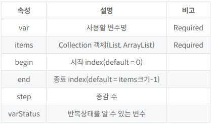

# Jstl
### <c:set />
- 변수 선언
- int count = 10
    - <c:set var="count" value="10">
### <c:remove />
- 변수 제거
### <c:out />
- 변수의 출력
- <c:out value="hello">
### <c:catch />
- 예외처리
### <c:if />
- 조건문 
- else 없음
- <c:if test="조건식"> 참일 때 실행할 문장</c:if>
### <c:choose /> <c:when /> <c:otherwise />
- switch문과 비슷
- when이 true면 해당 블럭 실행
- 모든 when이 false면 otherwise 실행
- <c:choose>
    <c:when test="${empty boardList}">
        등록된 글이 없습니다.
    </c:when>
    <c:when test="조건식">
        ...
    </c:when>
    <c:otherwise>
        ... 
    <c:otherwise>
  </c:choose>
### <c:forEach />
- 반복문
- 
- <c:forEach var="item" items="${list}" begin=0 end=5 step=1 varStatus="status">
      번호 : ${status.count}
      이름 : ${item.name}
      나이 : ${item.age}
      주소 : ${item.addr}
  </c:forEach>
### <c:url />
- URL 생성

- <a href="<c:url value='/userSearch.do?name=홍길동&page=3' />">3 페이지</a>

- <c:url value="/userSearch.do" var="url">
    <c:param name="name" value="홍길동" />
    <c:param name="page" value="3" />
  </c:url>

  <a href="${url}">3 페이지</a>

### <c:import />
- 페이지 첨부
- 지정된 url 태그에 있는 결과물을 현재 내 페이지의 특정 위치에 집어넣는 것
- 톰캣이 뒤에서 조용히 화면 결과물을 긁어온 뒤 현재 JSP 화면에 합쳐서 보여줌
- 웹사이트의 공통 메뉴(header), 푸터(footer), 사이드바처럼 여러 페이지에서 재사용하는 껍데기 화면들을 내 페이지에 조립할 때 사용

- <c:import url="URL값" var="변수명" scope="범위" varReader="변수명"? context="context명" charEncoding="인코딩값">

### <c:redirect />
- 지정된 URL 페이지로 이동시키는 기능
- <c:redirect url="URL값">

### <c:param />
- 파라미터 추가
- import나 redirect로 이동할 때 추가로 데이터를 실어서 보내고 싶을 때 사용
- ?msg=success, ?searchType=all같은 조건으로 이동